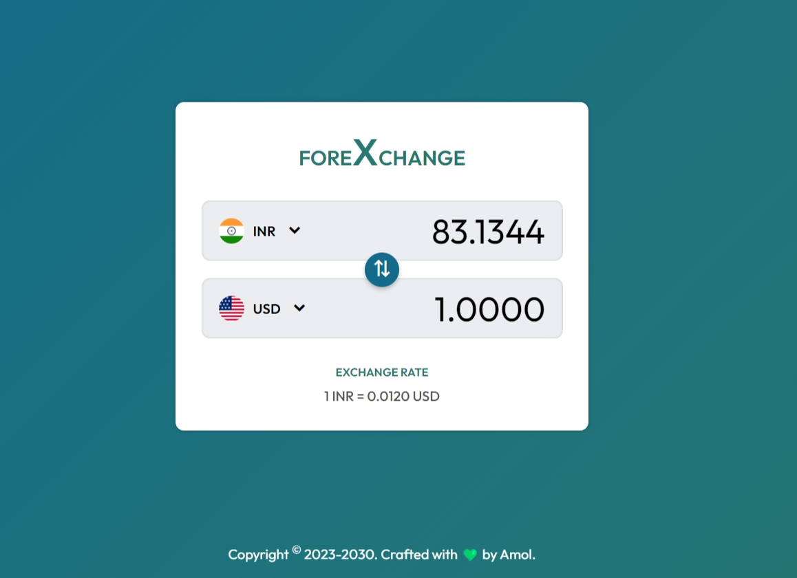

# 💱🌍 foreXchange-Currency Converter Web App 🌍💱

Welcome to the **foreXhange Currency Converter** web app! This app provides real-time exchange rate information to help users convert currencies from one value to another. 🌎💸

## 

## 

## ⚠️ Important Note

Base and target currencies are set as USD($) and INR(₹), however, users can always change them using the drop-down menu. 📉📈

## 🛠️ Tech Stack

- ☕ JavaScript
- 🌐 HTML
- 🎨 CSS

## 🌟 Features

- 📜 Toggle drawer to display currencies
- 🗂️ Display list of available currencies from API
- 🔍 Currency search functionality
- 🚫 Exclude current selected pairs (base and target currency)
- 🔄 Choose currency pairs for conversion
- 📊 Display exchange rate
- 🧮 Calculate and display the conversion result
- 🔁 Switch conversion pairs with one-click "swap"
- ⏳ Show loading indicator on data retrieval

## 📋 Requirements & Resources

- 🔑 FreeCurrency API Key
  - For more info, visit: [FreeCurrencyAPI](https://freecurrencyapi.com/). Register and get your own API Key.
- 🎨 Google Fonts

## 🚀 Prerequisites

You need a web browser to run the app. 🌍🖥️
